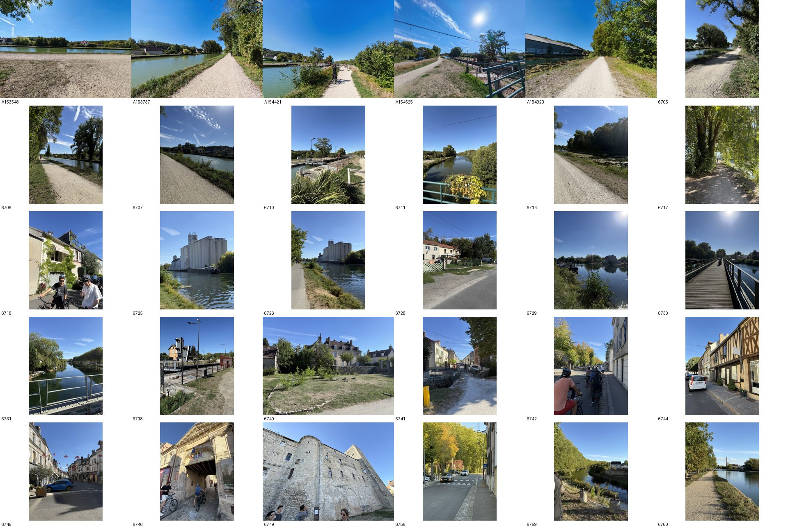
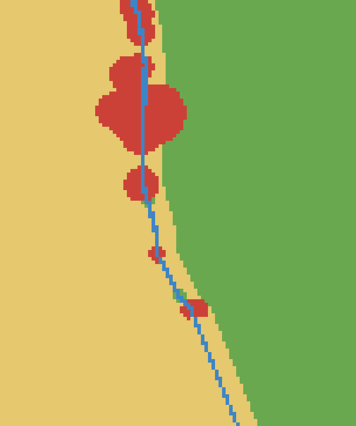

# VISTA Bike 2026 — Group 1

Submission for the **Scandibérique Map Challenge**: 30 photos and a land-cover map of
the valley.

Ride of 15 September 2026, 15:35 → 18:48 along the canal — a 12.9 km loop, two cameras,
53 photos taken, 30 submitted.

---

## The photos



The 30 handed in, chosen to match the map below.

| | observed cells | coverage < 150 m | vegetation |
|---|---:|---:|---:|
| all 51 unique photos | 93 | 55.0 % | 0.306 |
| **the 30 submitted** | **78** | **46.9 %** | 0.288 |

---

## The map

`submission/vista_submission.npy` — a 121 × 101 `uint8` array, values 1–5, every cell
filled.



| class | cells | share of the grid |
|---|---:|---:|
| `broadleaf` | 5,706 | 46.7 % |
| `conifer` | 0 | 0.0 % |
| `open` | 5,731 | 46.9 % |
| `water` | 161 | 1.3 % |
| `built` | 623 | 5.1 % |

No photo in the set carries a compass heading, so the 50 m disk convention applies:
the 30 photos observe **78 of the 12,221 cells — 0.6 % of the grid**. The remaining
99.4 % comes from the prior.

---

## Contents

```
photos/                  the 30 originals, EXIF intact
submission/
  vista_submission.npy   the 121 x 101 map
  map-preview.png        rendering of the above
data/
  selection-30.txt       the list
  photo_metadata.json    EXIF + measurements, all 53 photos
  photo_scores.csv       flat table
analysis/
  contact-sheet.jpg      the sheet above
  methodologie.html      method and results in full (French)
  corpus-notes.md        corpus notes (French)
  figures/               GPS track, fields of view, azimuths
scripts/
  extract_meta.py        EXIF + measurements  ->  photo_metadata.json
  choose_v4.py           route-based selection (exact DP)
  compare.py             metrics and Pareto front
  azimuth.py, synth.py   azimuth estimation, and its validation
```

The photos are the originals, EXIF preserved — the GPS tag is the only positional
information available.
