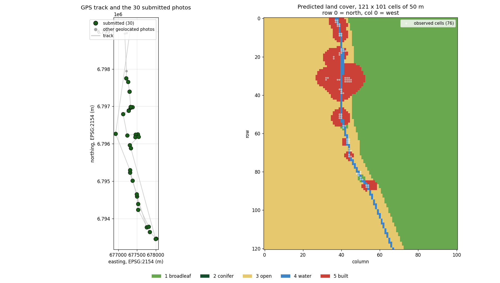

# VISTA Bike 2026 — Group 1

Submission **V2** for the **Scandibérique Map Challenge**: 30 photos and a land-cover
map of the valley.

Ride of 15 September 2026, 15:35 → 18:54 along the canal — a 12,959 m loop.
**438 photos taken by five cameras, of which only 53 carry a GPS fix**; 30 submitted,
all geolocated. See [analysis/CORPUS.md](analysis/CORPUS.md) for the full breakdown.

---

## The photos


All 30 carry a measured GPS fix, so the kit counts every one of them:
`kit.py observed` reports `30 photos -> 76 of 12221 cells`. No EXIF was modified — the
files are bit-for-bit identical to the originals.

**How they were chosen.** The set comes from the map-building pipeline, then two frames
without an EXIF GPS tag were swapped out for two geolocated ones, picked greedily for
the number of *new* grid cells they open (+3 and +1). That swap took the count from 28
usable photos and 72 cells to **30 and 76**.

`scripts/choose_v4.py` implements a different, self-contained selector — exact dynamic
programming that minimises the route's polyline simplification error. **It does not
reproduce the delivered set**; it is included because the route-error criterion it
optimises is a useful lens on any candidate selection, not because it produced this one.



---

## The map

`vista_submission.npy` at the repository root — a 121 × 101 `uint8` array, values 1–5,
every cell filled. (Also kept under `submission/` alongside its preview.)


| class | cells | share of the grid |
|---|---:|---:|
| `broadleaf` | 5,711 | 46.7 % |
| `conifer` | 0 | 0.0 % |
| `open` | 5,725 | 46.8 % |
| `water` | 159 | 1.3 % |
| `built` | 626 | 5.1 % |

No photo in the set carries a compass heading, so the 50 m disk convention applies.
The official kit mask counts **76 observed cells out of 12,221 — 0.6 % of the grid**.
The remaining 99.4 % comes from the prior.

Format validated by the official checker: `shape (121, 101), values 1..5`, no unknown
cell.

---

## Contents

```
vista_submission.npy     the map, at the root as <team>_submission.npy
vista_photos/            the 30 originals, EXIF intact
submission/
  vista_submission.npy   the 121 x 101 map
  map-preview.png        rendering of the above
data/
  selection-30.txt       the list
  photo_metadata.json    EXIF + measurements, all 53 photos
  photo_scores.csv       flat table
analysis/
  contact-sheet.jpg      the sheet above
  CORPUS.md              the corpus: contributors, GPS coverage, caveats
  figures/               route, submitted photos and predicted map
scripts/
  extract_meta.py        EXIF + measurements  ->  photo_metadata.json
  choose_v4.py           route-based selection (exact DP)
  compare.py             metrics and Pareto front for a candidate selection
  azimuth.py             heading estimation from feature matching (inconclusive, see below)
  synth.py               ground-truth validation of azimuth.py's geometry
```

The photos are the originals, EXIF preserved — the GPS tag is the only positional
information available.
